 

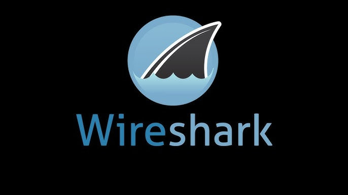

<h2>Connecting to the Windows Virtual Machine and Installing Wireshark</h2>

In the previous section, we created two virtual machines inside Microsoft Azure:

<ul>
<li>A <b>Windows virtual machine</b> that will be used to capture and analyze network traffic.</li>
<li>A <b>Linux virtual machine</b> that will be used to generate traffic across the network.</li>
</ul>

Because both machines are located inside the same <b>Virtual Network (VNet)</b>, they can communicate with each other just like computers on a local network.

In this section, we will connect to the Windows virtual machine using <b>Remote Desktop Protocol (RDP)</b> and install <b>Wireshark</b>, a network packet analyzer that allows us to capture and inspect network traffic.

---

<h3>What is Remote Desktop Protocol (RDP)?</h3>

<b>Remote Desktop Protocol (RDP)</b> is a network protocol developed by Microsoft that allows a user to remotely control another computer over a network connection.

Instead of physically sitting at the machine, RDP allows you to interact with the computer’s desktop as if you were using it locally. This is especially useful when working with cloud environments such as Azure where the machines exist in remote data centers.

In this lab, we will use RDP to connect to the Windows virtual machine so that we can install Wireshark and analyze network traffic.

---

<h3>Locating the Windows Virtual Machine Public IP Address</h3>

First, return to the <b>Virtual Machines</b> dashboard inside the Azure portal.

 

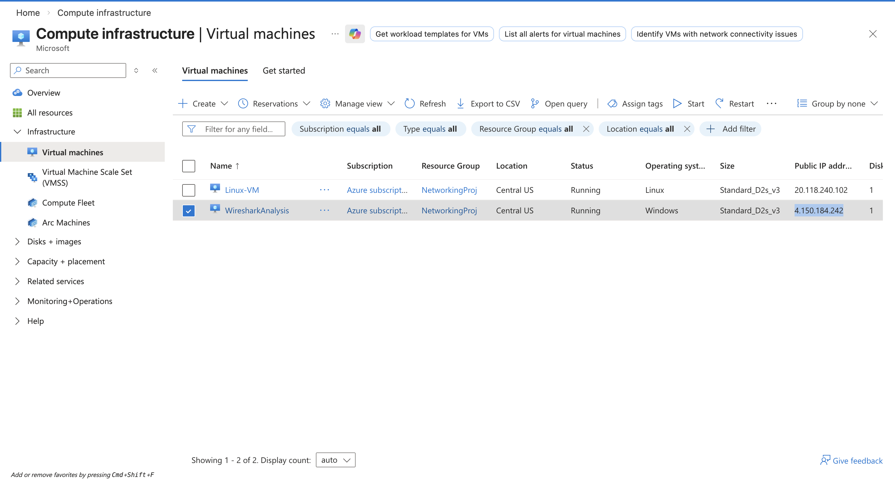

Here we can see both virtual machines that were created earlier:

<ul>
<li><b>Linux-VM</b> – Ubuntu machine used to generate traffic</li>
<li><b>WiresharkAnalysis</b> – Windows machine used to analyze traffic</li>
</ul>

Notice the <b>Public IP Address</b> assigned to the Windows VM. This address allows us to remotely connect to the system from our local computer using Remote Desktop.

---

<h3>Opening the Remote Desktop Client</h3>

To connect to the Windows VM, open the <b>Microsoft Remote Desktop</b> application on your computer.

 

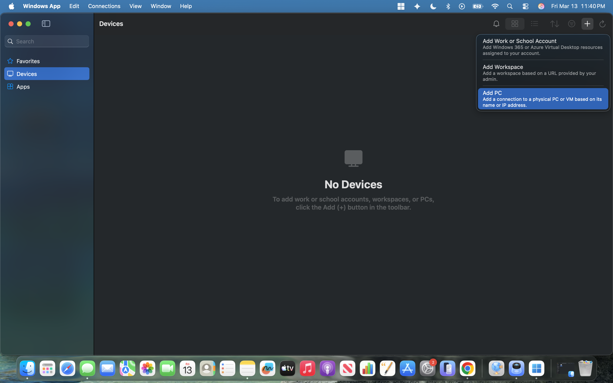

Inside the application, click the <b>+</b> icon and select <b>Add PC</b>.

This option allows you to create a new remote desktop connection to a computer using its IP address.

---

<h3>Configuring the Remote Desktop Connection</h3>

Enter the <b>Public IP Address</b> of the Windows virtual machine into the <b>PC name</b> field.

 

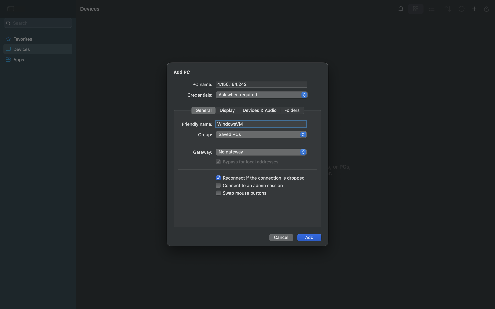

You can also enter a <b>Friendly name</b> such as <b>WindowsVM</b> to make the connection easier to identify later.

Leave the other settings at their default values and click <b>Add</b>.

---

<h3>Connecting to the Windows Virtual Machine</h3>

Once the connection has been added, the Windows VM will appear under <b>Saved Devices</b>.

 

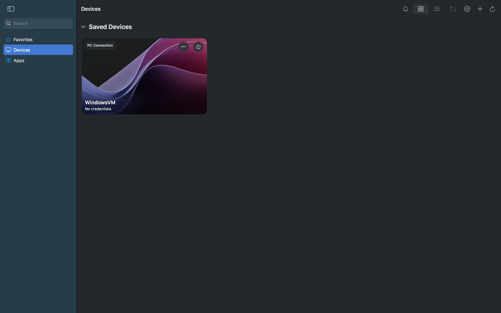

Double-click the device to begin the connection process.

---

<h3>Entering Your Login Credentials</h3>

When prompted, enter the username and password that were created earlier when the Windows virtual machine was deployed.

 

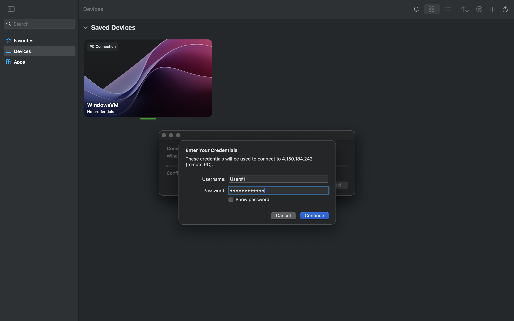

These credentials allow Azure to verify that you have permission to access the system.

---

<h3>Security Certificate Warning</h3>

You may see a certificate verification message when connecting for the first time.

 

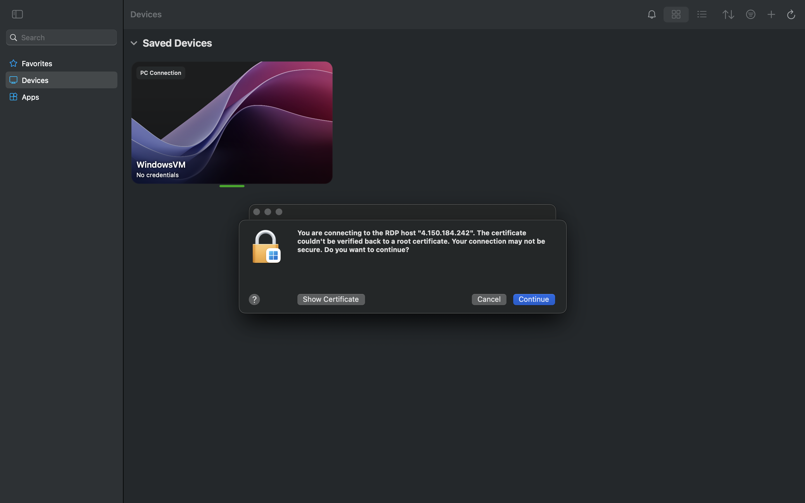

This warning appears because the remote desktop client cannot verify the certificate used by the virtual machine.

Since this is a lab environment that we created ourselves, it is safe to click <b>Continue</b>.

---

<h3>Logging Into the Windows Virtual Machine</h3>

After authentication, the Windows operating system will begin loading inside the remote desktop session.

 

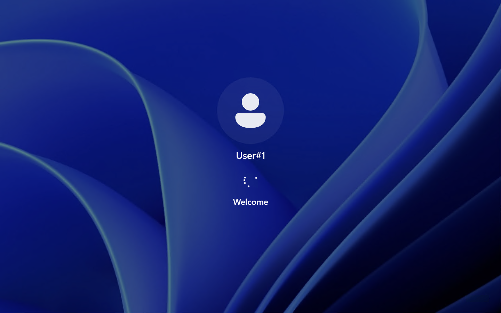

Once the login process completes, you will have full access to the Windows desktop environment running inside Microsoft Azure.

From here, we can install and run software just like we would on a physical computer.

---

<h3>Installing Wireshark</h3>

Now that we are connected to the Windows virtual machine, the next step is to install <b>Wireshark</b>.

Wireshark is a powerful <b>network protocol analyzer</b> that captures packets traveling across a network and displays their contents in detail.

Security analysts, network engineers, and incident responders use Wireshark to investigate network activity, troubleshoot connectivity issues, and analyze suspicious traffic.

 

<h3>Completing the Windows First-Time Setup</h3>

When connecting to the Windows virtual machine for the first time, Windows will display a privacy configuration screen. This is a standard setup process that allows users to choose how certain features and diagnostic data are handled.

Since this machine is being used only for a lab environment, the default options can remain enabled.

 

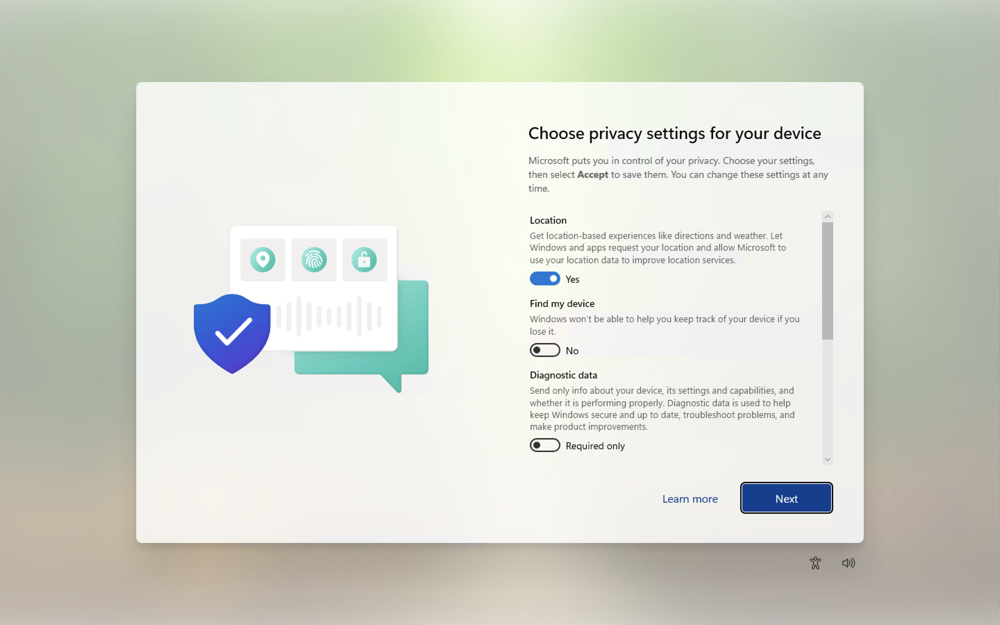

Review the available options and click <b>Next</b> to continue.

 

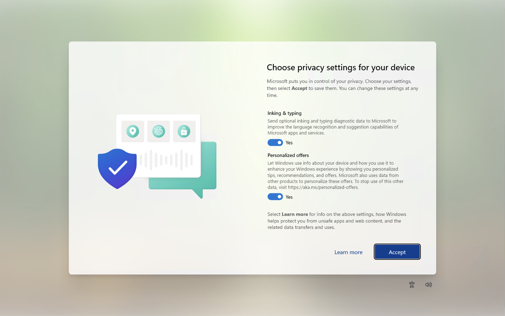

After reviewing the remaining privacy options, click <b>Accept</b> to complete the Windows setup process.

Once this step is finished, the Windows operating system will finish loading and display the desktop environment.

---

<h3>Opening a Web Browser</h3>

After the Windows desktop loads, open the Microsoft Edge browser. This browser will be used to download Wireshark directly onto the virtual machine.

 

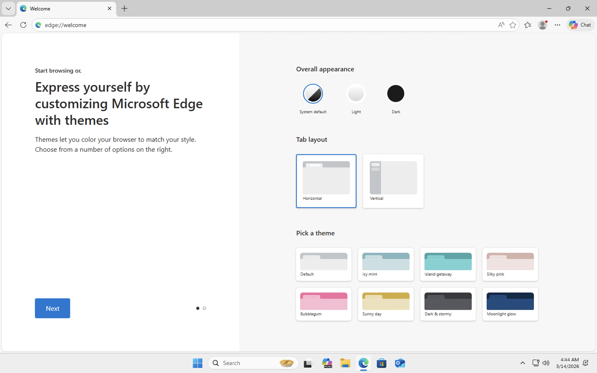

If the Edge welcome screen appears, you can click through the setup prompts or simply close the setup tabs to continue.

---

<h3>Searching for Wireshark</h3>

In the browser search bar, type <b>Wireshark</b> and perform a search.

 

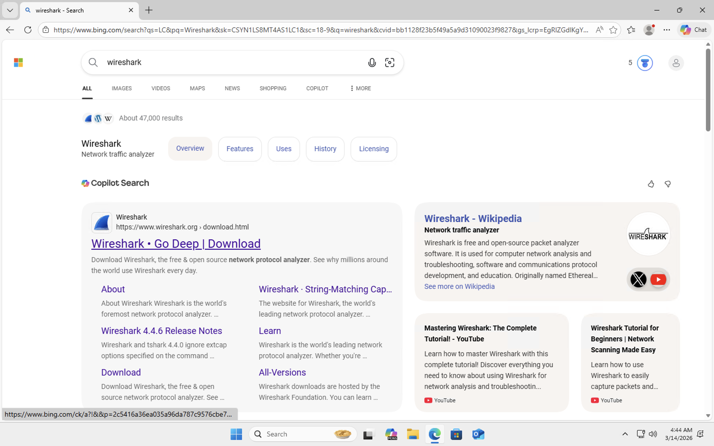

Select the official Wireshark website from the search results.

The official website is maintained by the Wireshark Foundation and provides the latest stable versions of the software.

---

<h3>Downloading Wireshark</h3>

Once the website loads, scroll down to the <b>Download Wireshark</b> section.

 

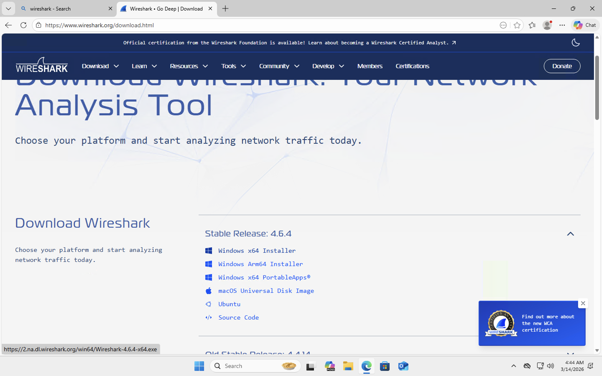

Select the <b>Windows x64 Installer</b>. This version is designed for 64-bit Windows operating systems, which is the configuration used by our virtual machine.

After clicking the installer link, the Wireshark setup file will begin downloading.

---

<h3>Download Progress</h3>

 

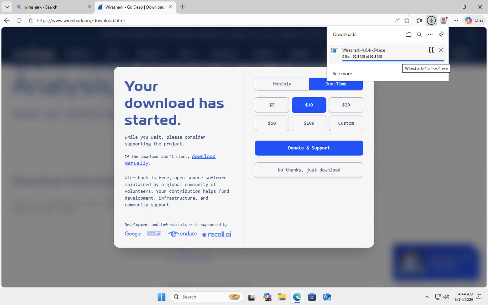

The download may take a few moments depending on network speed. Once the download completes, the installer can be opened to begin the installation process.

 

<h3>Opening the Wireshark Installer</h3>

Once the Wireshark installer has finished downloading, navigate to the <b>Downloads</b> folder inside the Windows virtual machine.

 

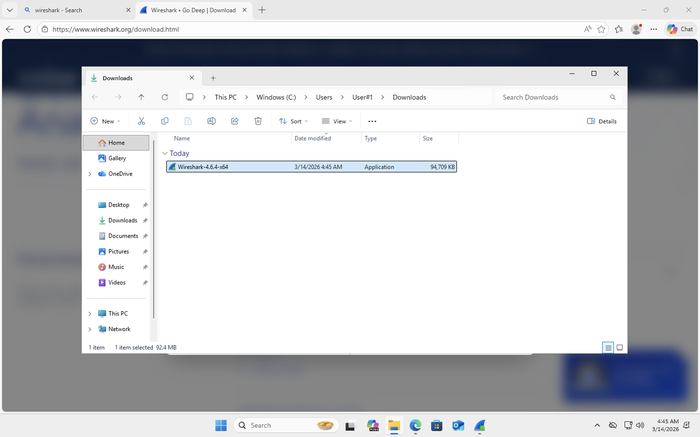

Locate the installer file named <b>Wireshark-4.6.4-x64</b>. This file contains the setup wizard that will install Wireshark onto the Windows system.

Double-click the installer to begin the installation process.

---

<h3>Wireshark Setup Wizard</h3>

After opening the installer, the Wireshark setup wizard will appear. This wizard guides users through the steps required to install the application.

 

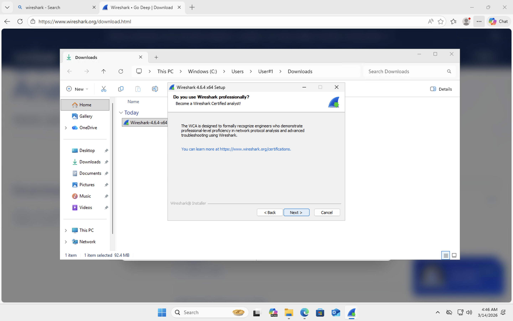

Click <b>Next</b> to continue.

---

<h3>License Agreement</h3>

Before installing the software, Wireshark displays the license agreement. Wireshark is distributed under the <b>GNU General Public License (GPL)</b>, which allows users to freely use, modify, and distribute the software.

 

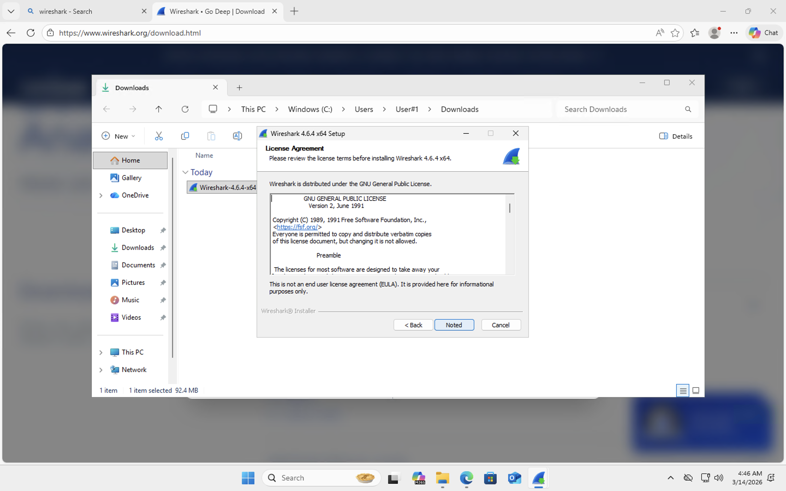

Review the license information and click <b>Noted</b> to proceed.

---

<h3>Selecting Installation Options</h3>

The installer will now present several configuration options. These options allow users to create shortcuts and associate certain file types with Wireshark.

 

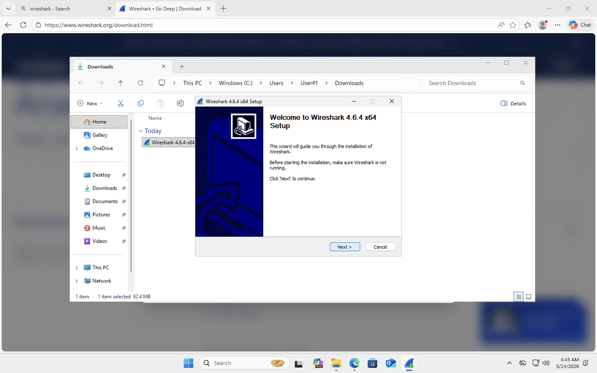

For this lab environment, the default settings are sufficient. The options to create a <b>Start Menu item</b> and a <b>Desktop icon</b> make it easier to launch Wireshark later.

Click <b>Next</b> to continue.

---

<h3>Selecting the Installation Location</h3>

Next, choose the location where Wireshark will be installed on the system.

 

By default, Wireshark installs into the following directory:

<b>C:\Program Files\Wireshark</b>

This default location is recommended for most installations, so no changes are required for this lab.

Click <b>Next</b> to continue.

---

<h3>Installing Required Packet Capture Drivers</h3>

Wireshark requires special drivers in order to capture network packets directly from a network interface.

The installer will prompt you to install <b>Npcap</b>, a packet capture library that allows Wireshark to monitor and capture network traffic.

 

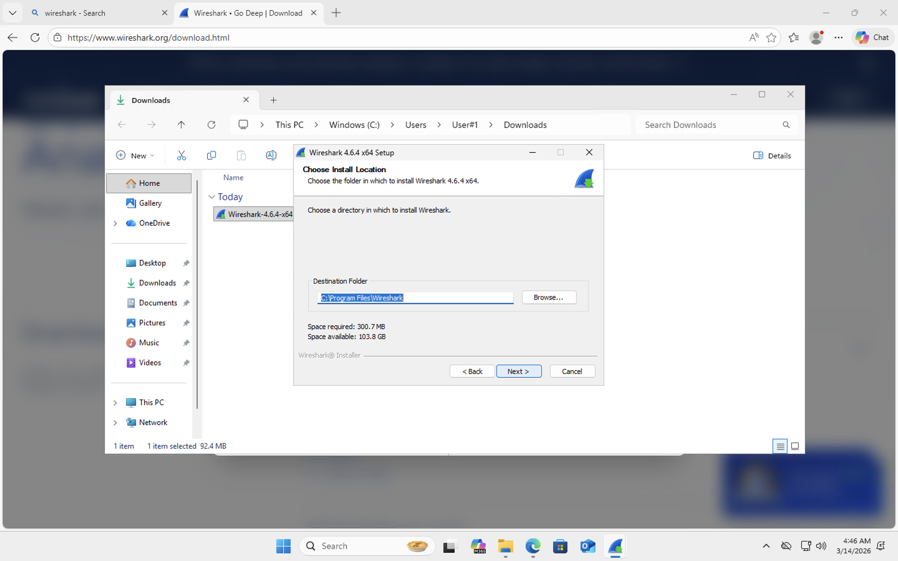

Npcap enables Wireshark to intercept packets traveling through the system’s network adapter. Without this component, Wireshark would not be able to capture network traffic.

Leave the default options selected and proceed with the installation.

After Npcap is installed, the Wireshark installation process will complete and the application will be ready to use.

 

<h3>Installing the Packet Capture Driver (Npcap)</h3>

Wireshark requires a packet capture driver in order to monitor network traffic traveling through the system’s network adapter. This driver allows Wireshark to intercept and analyze packets in real time.

During the installation process, the Wireshark setup wizard will prompt you to install <b>Npcap</b>. Npcap is a packet sniffing library developed by the Nmap Project and is required for capturing network packets on Windows systems.

 

Ensure the option to <b>Install Npcap</b> is selected, then click <b>Next</b>.

---

<h3>Optional USB Capture Support</h3>

The installer may also prompt you with an option to install <b>USBPcap</b>, which allows Wireshark to capture USB traffic.

 

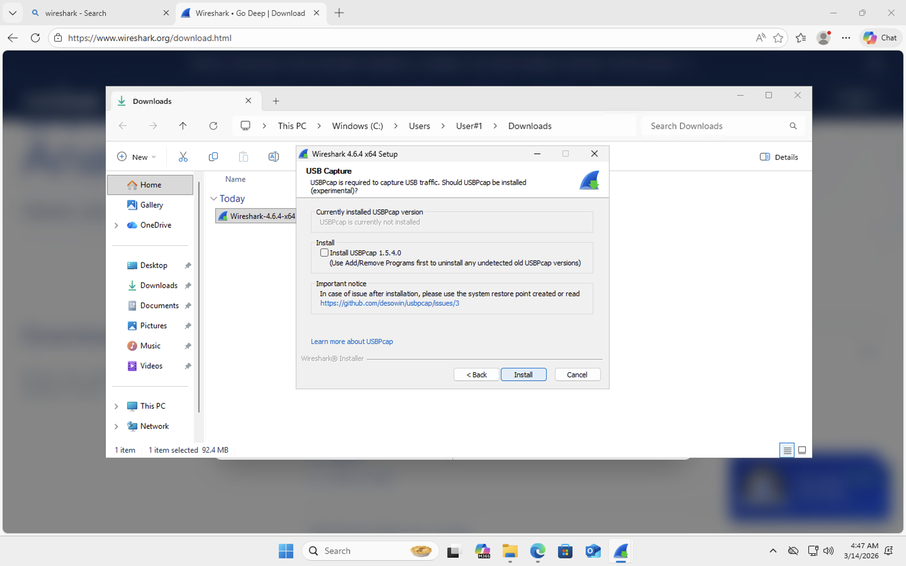

Since this lab focuses on network traffic analysis rather than USB traffic, this option can remain unchecked. Click <b>Install</b> to continue.

---

<h3>Npcap License Agreement</h3>

Before Npcap can be installed, the installer will display the license agreement.

 

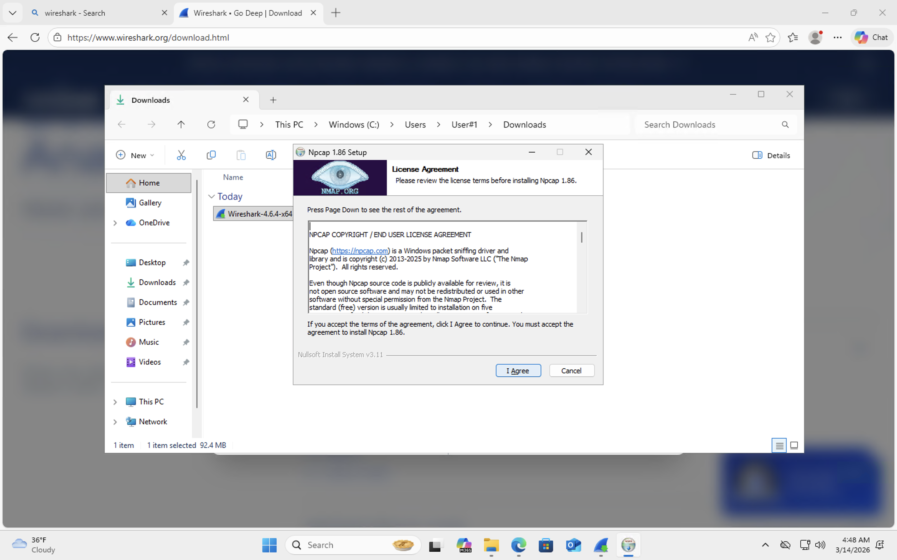

Click <b>I Agree</b> to proceed with the installation.

---

<h3>Npcap Installation Process</h3>

The installer will now begin installing Npcap. This process may take a few moments to complete.

 

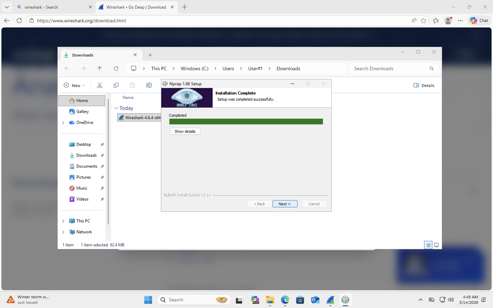

Once the installation finishes successfully, you will see a confirmation message.

---

<h3>Npcap Installation Complete</h3>

 

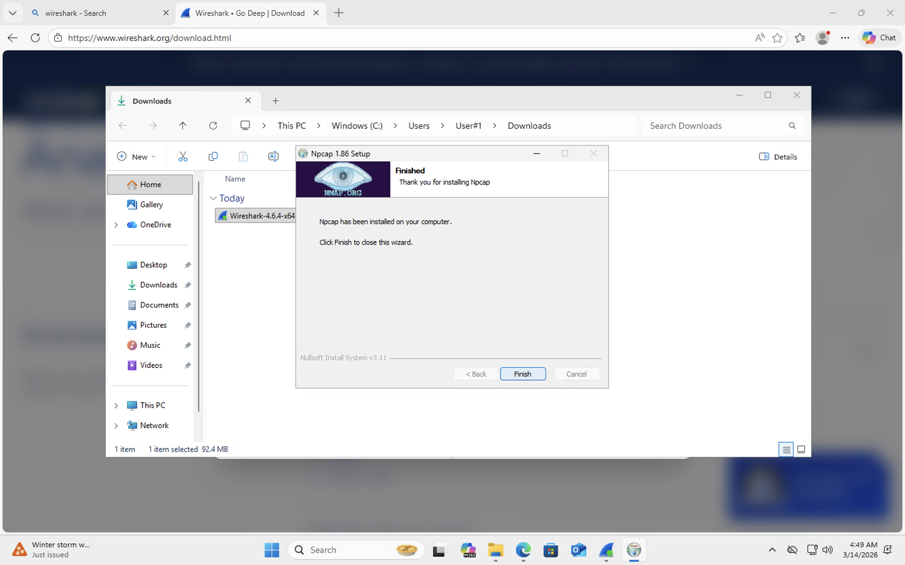

Click <b>Finish</b> to close the Npcap setup wizard and return to the Wireshark installation.

---

<h3>Completing the Wireshark Installation</h3>

After Npcap has been installed, the Wireshark setup wizard will finalize the installation.

 

Click <b>Finish</b> to complete the Wireshark installation process.

At this point, Wireshark is now installed on the Windows virtual machine.

---

<h3>Launching Wireshark</h3>

After installation, you should see a <b>Wireshark desktop icon</b> on the Windows virtual machine.

 

Double-click the Wireshark icon to launch the application.

---

<h3>Starting a Packet Capture</h3>

When Wireshark opens, it will display the available network interfaces on the system. These interfaces represent the network adapters that Wireshark can monitor for traffic.

 

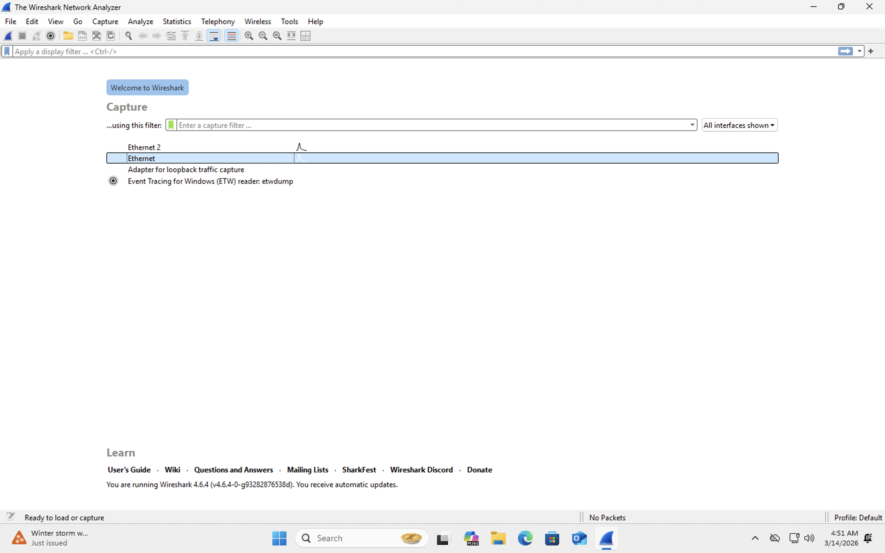

To begin capturing network traffic, locate the network interface labeled <b>Ethernet</b>.

Click on <b>Ethernet</b> to start capturing packets from the network adapter.

Once the capture begins, Wireshark will start displaying network packets in real time as they travel across the system’s network interface.

In the next section of this lab, we will begin analyzing specific types of network traffic including:

<ul>
<li>DHCP (Dynamic Host Configuration Protocol)</li>
<li>DNS (Domain Name System)</li>
<li>ICMP (Internet Control Message Protocol)</li>
<li>SSH (Secure Shell)</li>
<li>RDP (Remote Desktop Protocol)</li>
</ul>

Each of these protocols plays an important role in network communication and will help demonstrate how Wireshark can be used to analyze and troubleshoot network activity.

